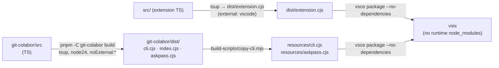

# Architecture

How Git Colabor is put together. Requirements live in [REQUIREMENTS.md](REQUIREMENTS.md); this document explains the design that satisfies them.

## 1. System overview

Two packages, one product:

```mermaid
flowchart LR
    subgraph ext ["VS Code extension (this repo)"]
        UI ["SCM tree view / status bar<br/>commands"]
        REC ["ReconcileController"]
        SYNC ["ScmSync (input box)"]
        APS ["AskpassServer<br/>(UNIX socket)"]
        SEC ["Secrets<br/>(SecretStorage)"]
        CC ["CliClient"]
    end
    subgraph cli ["git-colabor CLI (submodule, bundled)"]
        CLIC ["cli.cjs<br/>coauthor / identity"]
        CORE ["core: identity, coauthors,<br/>repo state, audit, git"]
        APH ["askpass.cjs<br/>(SSH_ASKPASS helper)"]
    end
    GIT["git / ssh-add / ssh-agent<br/>(workspace side)"]

    UI -->|"identity status --json"| CC
    REC -->|"identity use / _apply"| CC
    CC -->|"spawn process.execPath"| CLIC
    CLIC --> CORE
    CORE -->|"exec (arg arrays)"| GIT
    CORE -.->|"SSH_ASKPASS=askpass.cjs"| APH
    APH -->|"token + fingerprint"| APS
    APS --> SEC
```

Key decisions:

- **The CLI owns all git/SSH logic.** The extension is a UI and bridge; it never shells out to git itself. Everything runs **workspace-side** (where the repo and `ssh-agent` live), so Remote-SSH / Codespaces behave like local.
- **The extension consumes built output, not source.** `git-colabor/` is a git submodule and standalone npm package; `build-scripts/copy-cli.mjs` copies its `dist/{cli,askpass}.cjs` into the extension's `resources/` at build time. The vsix therefore ships with **zero runtime `node_modules`**.
- **One process boundary, one protocol.** Extension ↔ CLI speaks a stable `--json` envelope (§3). Passphrases cross a *second*, separate channel — the askpass socket (§4) — never argv.

## 2. Extension module map (`src/`)

| Module | Responsibility |
| --- | --- |
| `extension.ts` | Activation: session id (`ext_<hex>`), AskpassServer + session file, GitApi, CliClient, tree view, status bar, ScmSync, commands, watchers, reconcile wiring; dispose logic |
| `cli/CliClient.ts` | Spawns `resources/cli.cjs` with `process.execPath` (the VS Code Server's Node — no `$PATH` dependency), injects `GIT_COLABOR_SOURCE=ext` + askpass env, parses the JSON envelope, maps spawn/parse failures to `SPAWN_FAILED` / `BAD_JSON` |
| `askpass/AskpassServer.ts` | `node:net` UNIX socket `<dataDir>/askpass-<sessionId>.sock` (dir `0700`, socket `0600`); one request per connection: `{"token","fingerprint"}` → passphrase bytes; silent close on any failure so callers fall through |
| `secrets/Secrets.ts` | SecretStorage wrapper; keys `ssh-pass:<fingerprint>` |
| `git-ext/GitApi.ts` | Minimal typed wrapper over `vscode.git` API v1: repositories, open/close/`ui.onDidChange` subscription, selected-repo resolution |
| `tree/IdentityTreeProvider.ts`, `tree/items.ts` | SCM view `gitColabor.identitiesView`: guidance rows only at the top (no repo / no active identity — the active identity is NOT duplicated at root; the Identities group marks it ✓), Identities group, and **one merged Co-authors list** (`.git-coauthors` catalogue ∪ all identities minus the active one ∪ `gitColabor.coAuthors` memory in user/machine/workspace layers ∪ repo commit history, email-deduped; empty state explains how to add) whose rows show `+`/`-` by whether the author's trailer is in the SCM input box (polled — the git API has no inputBox change event; no context menu on these rows — clicking toggles the trailer); identity rows instead carry the memory bits in their contextValue, driving the right-click "save/remove as co-author memory" menu (per scope, three items) |
| `statusbar/StatusBar.ts` | `$(person) name · +N`; click → identity picker |
| `scm/Sync.ts` | Idempotent reseed of `Co-authored-by:` trailers into the SCM input box (skip when the sorted-email key is unchanged) |
| `reconcile/ReconcileController.ts` | Setting-wins enforcement (§6) |
| `commands.ts` | All palette commands + internal tree-click commands |
| `config.ts`, `log.ts`, `types.ts` | Settings access, output channel, local mirror of the CLI JSON types |

## 3. The `--json` bridge

Every CLI command accepts `--json` and prints one compact line:

```json
{"ok":true,"data":{…},"warnings":[{"code":"conflict","message":"…"}]}
{"ok":false,"error":{"code":"NOT_FOUND","message":"…","hints":[…],"exitCode":5},"data":null}
```

- `CliClient.run(args)` defaults to JSON mode and returns the parsed envelope; the process exit code travels inside `error.exitCode` (0 ok · 1 runtime · 2 usage · 3 not-a-repo · 4 secret-unavailable · 5 not-found · 6 conflict-blocked).
- `types.ts` keeps a **hand-maintained mirror** of the CLI's JSON shapes (`StatusJson`, `IdentityJson`, `HeldByJson`, …) — there is no runtime dependency between the packages, so the mirror must be updated together with `git-colabor/src/core/types.ts`.
- `identity status --json` is the UI's heartbeat: the tree provider, status bar, and ScmSync all re-render from it.

## 4. The askpass bridge (passphrase channel)

Goal: `ssh-add` needs the passphrase; the extension holds it in SecretStorage; it must never appear on `argv` (visible in `ps`), in the CLI's logs, or in the audit log.

```mermaid
sequenceDiagram
    participant E as Extension (AskpassServer)
    participant C as CLI (loadKey)
    participant A as askpass.cjs (SSH_ASKPASS)
    participant S as ssh-add

    C->>S: setsid ssh-add <key> (env: SSH_ASKPASS=askpass.cjs, SSH_ASKPASS_REQUIRE=force, GIT_COLABOR_ASKPASS_SOCK/TOKEN)
    S->>A: prompts for passphrase
    A->>E: {"token","fingerprint"}\n over askpass-<sessionId>.sock
    E->>E: timingSafeEqual(token); lookup ssh-pass:<fingerprint> in SecretStorage
    E-->>A: passphrase bytes (or silent close)
    A-->>S: passphrase on stdout
    S-->>C: key loaded (or fail → next strategy)
```

- **Load strategy chain** (never throws; reports `via`): plain `ssh-add` → macOS keychain (`--apple-use-keychain`, when supported) → askpass bridge → interactive tty. Outside the extension the same chain applies with `passphrase-command` in place of the socket.
- **Discovery for terminal use:** the extension writes `<dataDir>/session-<pid>.json` (`0600`: sessionId, socketPath, token), so a user-invoked `git colabor` in the integrated terminal can find the bridge even though it wasn't spawned by the extension.
- **Failure is silent by design:** on any protocol error the server closes without writing, and the caller falls through to the next strategy rather than blocking a commit.

## 5. Identity apply (single-writer with backup)

`identity use <id>` (CLI core `identity/apply.ts`):

1. Detect conflict — if per-repo `state.heldBy` names a *different, fresh* (< 5 min) session, warn (or refuse with exit 6 under `--no-override`).
2. **First-touch backup** — when `colabor.managed != true` and no backup exists, snapshot local `user.name`, `user.email`, `core.sshCommand`, `commit.template` (including "unset") into `<git-dir>/colabor/state.json`.
3. Write local config: `user.name`, `user.email`, `core.sshCommand` (only if the identity has a key), `colabor.managed=true`, `colabor.managed-by=cli|ext`.
4. Update state (`activeIdentity`, `heldBy=<this session>`), load the key (§4), append audit `identity.use`.

`identity revert` restores all four keys from the backup (unsetting those that were unset), removes the key from the agent, unsets the markers and `colabor.selected`, clears state. `identity logout` is the security half: agent removal + key-file shredding, repo config untouched.

## 6. The reconcile loop (setting-wins)

`ReconcileController` enforces VS Code settings over whatever else (including the user's terminal) has touched the repo:

1. Resolve the repo (`vscode.git` selection). No repo → no-op.
2. `identity status` → `activeId = activeIdentity ?? gitColabor.defaultIdentity`.
3. If an id resolves: `identity use <id> --source ext`, adding `--as-name`/`--as-email` **only when both** `gitColabor.user.name` and `.email` are set — settings always win over the identity's own fields (the SSH key still comes from the identity).
4. Else if both name+email settings exist (no identity): hidden `identity _apply --name --email --source ext`.
5. Surface `data.conflict.heldBy` as a warning notification.

**Triggers:** activation; repo open/close/selection change (400 ms debounce, then reconcile + refresh); `gitColabor.user.*` / `gitColabor.defaultIdentity` setting changes. The state-file watcher below deliberately triggers only a *refresh* — reconciling on it would fight the terminal CLI that just wrote the state.

## 7. UI refresh & drift watchers

| Watcher | Event | Action |
| --- | --- | --- |
| `fs.watch(<repo>/.git/colabor/state.json)` | terminal `git colabor` ran out-of-band | 300 ms debounce → tree/statusbar refresh only |
| `onDidSaveTextDocument` | `.git-coauthors` saved | refresh |
| `vscode.git` subscription | repo open/close, selection change | 400 ms debounce → reconcile + refresh |
| `provider.onDidReload` | every reload | status bar update + ScmSync reseed |

ScmSync strips all existing `Co-authored-by:` lines from the SCM input box value and re-appends the current selection — but computes a key from the sorted selected emails and skips the write when unchanged, so a user typing in the box is never clobbered mid-keystroke. In the other direction, the co-author tree rows read the box (`scm/trailers.ts` parses/appends/removes single trailers) and a 1.5 s poll refreshes the `+`/`-` markers as the user types; toggling a row edits the box directly and best-effort syncs `coauthor use`/`solo` so the commit template follows (skipped when the box holds trailers outside the catalogue).

## 8. Data model (what lives where)

| Store | Path | Written by | Mode |
| --- | --- | --- | --- |
| Identity map | `~/.config/git-colabor/identities.json` (Win: `%APPDATA%\git-colabor\…`) | CLI | `0600`, atomic tmp+rename |
| Imported keys | `…/git-colabor/keys/<fingerprint>.key` | CLI | `0600` / `icacls` |
| Audit log | `…/git-colabor/audit.log` (JSONL) | CLI | `0600` per append |
| Askpass socket + session file | `…/git-colabor/askpass-<session>.sock`, `session-<pid>.json` | extension | `0600` (dir `0700`) |
| Per-repo state | `<git-dir>/colabor/state.json` | CLI | `0600`, atomic |
| Co-author catalogue | `.git-coauthors` (repo → home fallback) | CLI / user | — |
| Commit template | `~/.gitmessage` or `commit.template` | CLI | — |
| Passphrases | VS Code SecretStorage (`ssh-pass:<fp>`) | extension | VS Code-managed |
| Git config (local) | `user.name`, `user.email`, `core.sshCommand`, `colabor.managed`, `colabor.managed-by`, `colabor.selected` (multi) | CLI | — |

Atomicity rule: every JSON store is written via write-tmp-then-rename, so a crash mid-write never corrupts state.

## 9. Error handling

- CLI: typed `AppError` codes → stable exit codes (§3) + `hints[]` in the envelope; the extension surfaces them as `Git Colabor: <message>` + hints.
- All `git` / `ssh-add` / `ssh-keygen` invocations use **argument arrays** (never shell strings), so file paths with spaces or metacharacters are safe and nothing is injection-reachable through repo paths.
- The CLI never throws for *expected* failures (key load, permission tightening, audit append are best-effort with `warnings`); it exits non-zero only for conditions the caller must handle.

## 10. Build & packaging flow



See [DEVELOPMENT.md](DEVELOPMENT.md) for commands and release procedure.
