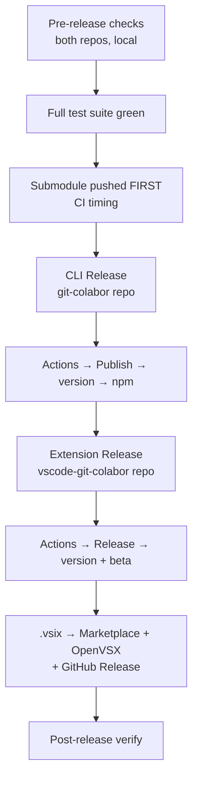

# Release Guide

Step-by-step procedure for releasing the VS Code extension and the `git-colabor` CLI. Both release independently from their own repositories via manual GitHub Actions dispatch.

## Overview



## 1. Pre-release checklist

Run this from the parent repo root.

### 1.1 Full test suite

```bash
# extension (repo root)
pnpm typecheck && pnpm lint && pnpm test

# CLI (submodule)
pnpm -C git-colabor typecheck && pnpm -C git-colabor lint
pnpm -C git-colabor test && pnpm -C git-colabor test:e2e
```

All must pass. Fix any failures before proceeding.

### 1.2 Push the submodule FIRST

This is the most common CI failure. The parent repo's CI checks out the submodule at the commit its pointer references — if that commit isn't on the remote yet, CI dies with `not our ref`.

```bash
cd git-colabor
git add -A
git commit -m "chore: prepare v0.2.0"
git push origin main        # ← ALWAYS push the submodule first
cd ..
```

Then push the parent:

```bash
git add git-colabor                # submodule pointer
git commit -m "chore: bump git-colabor for v0.2.0"
git push origin main               # ← triggers CI
```

Verify CI passes before proceeding: `gh run list --limit 1`.

## 2. Release the CLI (git-colabor → npm)

1. Go to `github.com/hnrobert/git-colabor/actions`
2. Select **Publish** workflow
3. Click **Run workflow**
4. Enter version (e.g. `0.2.0`; leading `v` is optional)
5. Click **Run**

The workflow:

- Runs the full test gate
- Bumps `package.json` version
- Commits + tags `v0.2.0`
- Runs `npm publish --provenance` (OIDC, no token secret)

For a prerelease, enter e.g. `0.3.0-beta.1` — it publishes under the `beta` dist-tag.

### One-time setup (already done for this project)

- First version was published locally: `npm publish --access public`
- npmjs.com → `git-colabor` → Settings → Trusted Publishers → bound to `hnrobert/git-colabor` / `publish.yml`

## 3. Release the extension (vscode-git-colabor → Marketplace + OpenVSX)

1. Go to `github.com/hnrobert/vscode-git-colabor/actions`
2. Select **Release** workflow
3. Click **Run workflow**
4. Enter version (e.g. `0.2.0`)
5. Optionally check **beta** for a pre-release
6. Click **Run**

The workflow:

- Runs the full test gate (root + submodule)
- Bumps `package.json` version
- Commits + tags `v0.2.0`
- Builds the `.vsix`
- Creates a GitHub Release with the `.vsix` attached
- Publishes to **Visual Studio Marketplace** (`vsce publish`)
- Publishes to **OpenVSX** (`ovsx publish`)

### Required secrets (already configured)

| Secret | Scope | Source |
| --- | --- | --- |
| `VSCE_PAT` | Marketplace | <https://dev.azure.com> → Personal Access Tokens (Manage scope) |
| `OVSX_PAT` | OpenVSX | <https://open-vsx.org> → Settings → Access Tokens |

### Beta / pre-release

Check the **beta** input. The `.vsix` is published with `--pre-release` on both marketplaces and the GitHub Release is marked as a prerelease.

## 4. Post-release verification

```bash
# CLI on npm
npm view git-colabor version

# Extension on Marketplace
# https://marketplace.visualstudio.com/items?itemName=hnrobert.vscode-git-colabor

# Extension on OpenVSX
# https://open-vsx.org/extension/hnrobert/vscode-git-colabor

# GitHub Releases
gh release list --repo hnrobert/vscode-git-colabor
gh release list --repo hnrobert/git-colabor
```

## 5. Troubleshooting

### CI fails with `not our ref <sha>` in submodule checkout

The parent repo references a submodule commit that hasn't been pushed to `git-colabor` yet. Push the submodule, then rerun the failed CI run:

```bash
cd git-colabor && git push origin main
cd .. && gh run rerun <run-id>
```

**Prevention**: always push the submodule before the parent (§1.3).

### CI fails with `The specified icon ... wasn't found in the extension`

The `.vscodeignore` file excludes submodule files but needs exceptions for the icon PNGs. Check that the icon entries exist:

```text
git-colabor/**
!git-colabor/assets/images/*.png
```

### vsce publish fails with `Personal Access Token expired`

Regenerate the `VSCE_PAT` secret:

1. <https://dev.azure.com> → User settings → Personal Access Tokens
2. Create new token (Organization: All, Scopes: Marketplace → Manage)
3. Update the `VSCE_PAT` secret in repo Settings → Secrets

### npm publish fails with `unauthorized`

The OIDC trusted publisher binding may have been changed. Verify on npmjs.com → `git-colabor` → Settings → Trusted Publishers:

- Repository: `hnrobert/git-colabor`
- Workflow: `publish.yml`
- Environment: (empty)

## 6. Version numbering conventions

| Component | Convention | Example |
| --- | --- | --- |
| Stable | semver `MAJOR.MINOR.PATCH` | `0.2.0` |
| Pre-release | `MAJOR.MINOR.PATCH-beta.N` | `0.3.0-beta.1` |
| Git tag | `v` + version | `v0.2.0` |

The extension and CLI version **independently** — they share no version coupling. The extension bundles whatever submodule commit is checked out at release time.

## 7. Hotfix flow

For an urgent fix to an already-released version:

1. Branch from the release tag: `git checkout -b fix/v0.2.1 v0.2.0`
2. Apply the fix, bump the patch version
3. Push the submodule (if CLI changed), then the parent
4. Release normally (§2, §3) with the patch version
5. Merge the fix branch back to `main`
